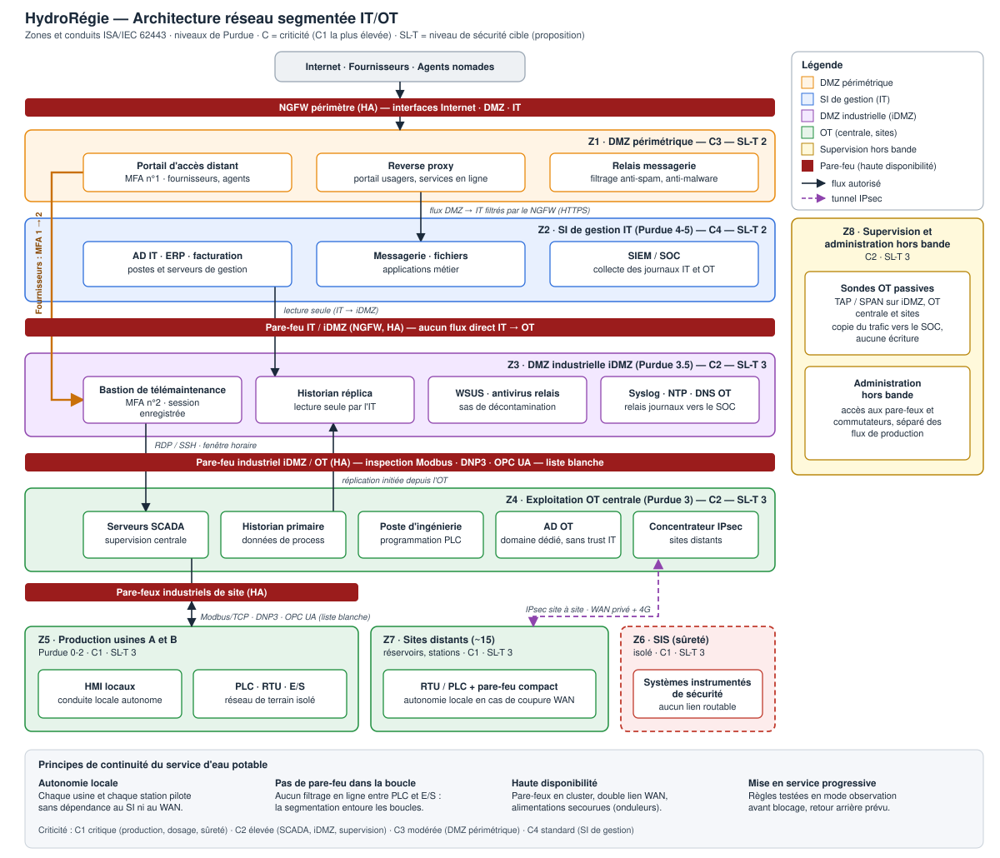
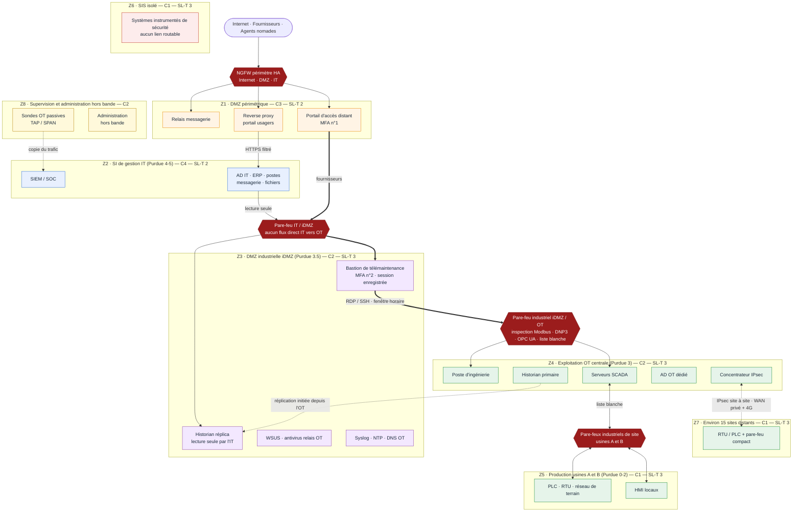

# Architecture réseau segmentée IT/OT — HydroRégie

**Bloc 3 — Zones, DMZ, niveaux de criticité, choix techniques justifiés (pare-feu, VLAN, VPN), continuité du service d'eau potable**
**Destinataires :** Direction générale, DSI, RSSI, direction technique et exploitation
**Date de la note :** 7 octobre 2026
**Actions du Bloc 2 couvertes :** A05, A06, A12, A17, A18, A19, A20, A22

---

## 1. Hypothèses de cadrage

| Élément | Hypothèse retenue |
|---|---|
| Topologie | 1 siège (SI de gestion), 2 usines de production et de traitement (A et B), environ 15 sites distants (réservoirs, stations de pompage) |
| OT | Parc mixte : une partie des automates et du SCADA renouvelée, une partie ancienne, inventaire incomplet (action A08) |
| Télémaintenance | Les fournisseurs OT interviennent à distance ; accès aujourd'hui non maîtrisés (action A06) |
| Référentiels | Zones et conduits ISA/IEC 62443, modèle de Purdue, directive (UE) 2022/2555 art. 21 (mesures e, i, j notamment), guides de l'ANSSI sur la cybersécurité des systèmes industriels |
| Équipements | Choix de marque laissé au marché public : le schéma décrit des fonctions, pas des références |
| Niveau de sécurité cible (SL-T) | Proposition de travail, à valider par l'analyse de risques EBIOS RM (action A09) |

---

## 2. Principes de conception

1. **Aucun flux direct entre l'IT et l'OT.** Toute communication passe par une zone intermédiaire (iDMZ, niveau 3.5 de Purdue), où les flux sont terminés, inspectés puis réémis.
2. **Les connexions sont initiées depuis la zone la plus sensible.** L'OT pousse ses données vers l'iDMZ ; l'IT les lit dans l'iDMZ. Aucune connexion n'est initiée de l'extérieur vers l'OT.
3. **Liste blanche.** Tout ce qui n'est pas explicitement autorisé est interdit, avec des règles par couple source/destination/service.
4. **Défense en profondeur.** Deux niveaux de filtrage successifs entre Internet et l'OT, de technologies et de rôles différents, plus une segmentation interne à l'OT.
5. **Autonomie des sites.** Chaque usine et chaque station continue de produire sans dépendre du SI de gestion ni du réseau étendu.
6. **Visibilité sans intrusion.** La supervision de sécurité de l'OT repose sur des sondes passives et une administration hors bande, sans écriture sur les automates.

---

## 3. Schéma d'architecture

*Fichiers du schéma : [SVG](Schema_Architecture_IT_OT_HydroRegie.svg) et [PNG](Schema_Architecture_IT_OT_HydroRegie.png). La version Mermaid ci-dessous est la même architecture, modifiable en texte.*

---

## 4. Zones, niveaux de criticité et objectifs de sécurité

**Échelle de criticité :** C1 critique (production d'eau potable, dosage, sûreté), C2 élevée (SCADA, iDMZ, supervision), C3 modérée (DMZ périmétrique), C4 standard (SI de gestion).
**SL-T :** niveau de sécurité cible au sens de l'IEC 62443-3-3 (1 à 4), proposé ici à titre de travail.

| Zone | Contenu | Purdue | Criticité | SL-T | Frontière de contrôle |
|---|---|---|---|---|---|
| Z1 DMZ périmétrique | Portail d'accès distant avec MFA, reverse proxy des services usagers, relais de messagerie | Hors modèle | C3 | 2 | NGFW de périmètre |
| Z2 SI de gestion (IT) | AD IT, ERP, facturation, postes, messagerie, SIEM/SOC | 4-5 | C4 | 2 | NGFW de périmètre et pare-feu IT/iDMZ |
| Z3 DMZ industrielle (iDMZ) | Bastion de télémaintenance, historian réplica, WSUS et antivirus relais, syslog/NTP/DNS OT | 3.5 | C2 | 3 | Pare-feu IT/iDMZ et pare-feu industriel iDMZ/OT |
| Z4 Exploitation OT centrale | Serveurs SCADA, historian primaire, poste d'ingénierie, AD OT dédié, concentrateur IPsec | 3 | C2 | 3 | Pare-feu industriel iDMZ/OT |
| Z5 Production usines A et B | HMI locaux, PLC, RTU, réseau de terrain | 0-2 | C1 | 3 | Pare-feux industriels de site |
| Z6 SIS | Systèmes instrumentés de sécurité (sécurités de traitement, dosage) | 0-2 | C1 | 3 | Aucun lien routable ; état remonté en lecture seule par liaison câblée ou diode |
| Z7 Sites distants | RTU et PLC des réservoirs et stations, pare-feu compact | 0-2 | C1 | 3 | Pare-feu compact et tunnel IPsec |
| Z8 Supervision et administration hors bande | Sondes passives, réseau d'administration des équipements réseau et de sécurité | Transverse | C2 | 3 | Réseau physiquement ou logiquement séparé, accès restreint |

**Lecture :** l'effort de sécurité est concentré sur ce qui touche la production (C1) et ce qui y mène (iDMZ, SCADA). L'IT de gestion n'est pas relâchée, mais elle n'est plus un chemin direct vers l'eau potable.

---

## 5. Matrice des flux

| ID | Source → destination | Service | Initiative | Décision | Justification |
|---|---|---|---|---|---|
| F01 | Internet → Z1 | HTTPS vers le reverse proxy | Extérieur | Autorisé | Services usagers, publiés uniquement via la DMZ |
| F02 | Z1 → Z2 | HTTPS applicatif vers les serveurs frontaux | Z1 | Autorisé, filtré | Application métier derrière le reverse proxy ; inspection par le NGFW |
| F03 | Fournisseurs → Z1 portail | HTTPS, MFA n°1 | Extérieur | Autorisé sous conditions | Seul point d'entrée distant, compte nominatif par intervenant |
| F04 | Z1 portail → Z3 bastion | RDP/SSH relayé, MFA n°2 | Z1 | Autorisé sous conditions | Session enregistrée, fenêtre horaire, justification de l'intervention |
| F05 | Z3 bastion → Z4/Z5 cibles désignées | RDP, SSH, protocoles d'administration du constructeur | Z3 | Autorisé sous conditions | Cibles listées explicitement, durée limitée, journalisation |
| F06 | Z4 historian primaire → Z3 historian réplica | Réplication (ex. SQL ou OPC UA) | Z4 | Autorisé | Les données de process sortent de l'OT sans connexion entrante |
| F07 | Z2 → Z3 historian réplica | Lecture (HTTPS ou SQL en lecture seule) | Z2 | Autorisé | L'IT consomme les données sans toucher à l'OT |
| F08 | Z2 → Z4/Z5/Z7 | Tous | Z2 | **Interdit** | Règle centrale : aucun flux direct IT vers OT |
| F09 | Z4/Z5/Z7 → Internet | Tous | OT | **Interdit** | Pas d'accès sortant depuis l'OT ; les mises à jour passent par l'iDMZ |
| F10 | Z4 serveurs SCADA ↔ Z5 PLC, RTU, HMI | Modbus/TCP, DNP3, OPC UA, protocoles constructeur | Z4 ou Z5 | Autorisé, liste blanche | Fonctionnement normal du process, inspection protocolaire |
| F11 | Z7 RTU/PLC ↔ Z4 concentrateur IPsec | IPsec puis DNP3 ou protocole RTU | Z7 ou Z4 | Autorisé | Sites distants raccordés au SCADA par tunnels chiffrés |
| F12 | Z3 WSUS et antivirus relais → Z4/Z5 | Mises à jour validées | Z4/Z5 vers Z3 (tirage) | Autorisé | Correctifs testés avant diffusion ; aucun accès à Internet depuis l'OT |
| F13 | Z4/Z5/Z7 → Z3 syslog, NTP, DNS | Syslog (TLS si possible), NTP, DNS interne | OT | Autorisé | Journalisation et horodatage cohérents |
| F14 | Z3 syslog → Z2 SIEM | Syslog sécurisé | Z3 | Autorisé | Les journaux OT alimentent le SOC |
| F15 | Z8 sondes ← miroir du trafic OT | TAP / SPAN, flux passif | Aucune | Autorisé | Détection d'anomalies sans écriture |
| F16 | Z6 SIS → Z4 SCADA | État en lecture seule, liaison câblée ou diode | SIS | Autorisé, unidirectionnel | Le SIS reste isolé, SCADA informé |
| F17 | Z6 SIS ↔ tout autre réseau routable | Tous | Tous | **Interdit** | Intégrité des fonctions de sûreté |

---

## 6. Choix techniques justifiés

### 6.1 Pare-feu

| Emplacement | Fonction | Justification |
|---|---|---|
| Périmètre (Internet, DMZ, IT) | NGFW en haute disponibilité : inspection applicative, IPS, filtrage d'URL, déchiffrement TLS sur les flux sortants | Menaces classiques d'un SI de gestion ; protection de la DMZ |
| IT / iDMZ | NGFW dédié, règles minimales | Frontière stricte entre le SI de gestion et l'OT ; sépare les responsabilités d'administration |
| iDMZ / OT | Pare-feu industriel en haute disponibilité, inspection des protocoles industriels (Modbus/TCP, DNP3, OPC UA) | Peut filtrer au niveau des commandes (par exemple interdire les écritures depuis une source non autorisée) |
| Sites de production | Pare-feu industriel de site, un par usine | Segmentation interne et autonomie du site |
| Sites distants | Pare-feu compact avec terminaison IPsec | Protège les petits sites sans alourdir l'exploitation |

**Choix structurant :** deux familles de technologie entre le périmètre IT et l'OT (NGFW et pare-feu industriel), de préférence de constructeurs différents. Une faille ou une erreur de configuration sur l'un ne neutralise pas l'autre. La marque est laissée au marché public.

**Contrepartie :** deux compétences à maintenir par une petite équipe. Si l'équipe ne peut pas absorber cette charge, le minimum acceptable est un même constructeur avec des consoles d'administration et des comptes séparés.

### 6.2 VLAN

Les VLAN structurent le réseau à l'intérieur d'un site. Ils ne constituent pas, à eux seuls, une frontière de sécurité : un mauvais paramétrage ou un saut de VLAN peut les contourner. Tout routage entre VLAN passe donc par un pare-feu, jamais par un routeur ou un commutateur de niveau 3 non filtré.

Plan indicatif par usine :

| VLAN | Usage | Remarque |
|---|---|---|
| 10 | Serveurs SCADA et historian de site | Accès restreint aux seuls flux de supervision |
| 20 | HMI et postes opérateurs | Postes durcis, ports USB contrôlés |
| 30 | PLC et RTU (réseau de terrain) | Aucune sortie vers le reste du réseau sans passage par le pare-feu |
| 40 | Poste d'ingénierie | Utilisé ponctuellement, connexion contrôlée |
| 50 | Services OT (DNS, NTP, AD OT local) | Services nécessaires à l'autonomie du site |
| 60 | Administration des équipements réseau | Séparé du trafic de production |
| 90 | SIS | Aucune passerelle ; isolé |

Durcissement des commutateurs : ports inutilisés désactivés, sécurité des ports (adresse MAC), VLAN natif inutilisé, trunks limités aux VLAN nécessaires, protection contre les boucles, administration par protocole chiffré uniquement.

### 6.3 VPN et accès distants

| Besoin | Solution | Justification |
|---|---|---|
| Sites distants → centre | Tunnels IPsec site à site (IKEv2, authentification par certificats, chiffrement AES-256-GCM) sur un WAN privé opérateur, avec 4G en secours | Confidentialité et intégrité des flux SCADA ; indépendance vis-à-vis d'Internet public |
| Fournisseurs et agents nomades | Portail d'accès distant en DMZ périmétrique avec MFA, puis bastion en iDMZ avec second facteur et enregistrement de session | Aucun VPN ne se termine directement dans l'OT ; l'accès est nominatif, borné dans le temps et tracé |
| Administration interne OT | Passage obligatoire par le bastion | Évite les postes d'administration connectés en permanence |

**Contrepartie :** le bastion devient un point critique. Il est donc en haute disponibilité, et une procédure d'accès de secours existe (compte d'urgence conservé hors ligne, usage soumis à l'autorisation du responsable d'exploitation et journalisé).

### 6.4 Autres choix

| Domaine | Choix | Justification |
|---|---|---|
| Identité | AD OT dédié, sans relation d'approbation avec l'AD IT ; comptes nominatifs et MFA sur le bastion | Une compromission de l'AD IT ne donne pas de droits dans l'OT |
| Mises à jour | WSUS et antivirus relais en iDMZ, sas de décontamination pour supports amovibles | Aucun accès Internet depuis l'OT ; mises à jour testées avant déploiement |
| Détection | Sondes passives sur TAP ou SPAN, syslog centralisé vers le SIEM | Voit les anomalies sans écrire sur des automates fragiles |
| Administration | Réseau hors bande pour les pare-feux et commutateurs | Un incident sur le réseau de production n'empêche pas de l'administrer |
| Diode de données | Option pour la remontée d'état du SIS et pour les usines les plus critiques | Garantit l'unidirectionnalité matériellement ; coût et complexité à arbitrer |

---

## 7. Continuité du service d'eau potable

Une mesure de sécurité qui coupe l'eau est pire que l'incident qu'elle devait prévenir. L'architecture répond à cette contrainte par six dispositions.

| # | Disposition | Effet |
|---|---|---|
| 1 | **Autonomie locale** : chaque usine et chaque site distant pilote son process avec ses PLC et HMI locaux, sans dépendre du SI, de l'iDMZ ou du WAN | La perte du centre, d'un lien ou de l'IT n'arrête pas la production |
| 2 | **Aucun pare-feu dans les boucles de contrôle temps réel** : la segmentation entoure les boucles entre PLC et E/S, elle ne les traverse pas | Pas de latence ni de point de défaillance sur la régulation |
| 3 | **Haute disponibilité** : pare-feux en cluster, double lien WAN (privé et 4G), alimentations secourues | Aucun équipement de sécurité n'est un point de défaillance unique |
| 4 | **Mode dégradé** : conduite manuelle documentée et exercée (action A16) | Les équipes savent produire sans supervision centralisée |
| 5 | **Déploiement sans coupure** : mode observation des pare-feux pendant 4 à 8 semaines avant blocage, interventions site par site hors pointes de consommation, retour arrière préparé | Aucune règle ne bloque un flux légitime non répertorié |
| 6 | **SIS indépendant** : aucun lien routable, état remonté en lecture seule | La sûreté de traitement ne dépend pas du réseau |

**Scénarios dimensionnants :**

| Scénario | Comportement attendu |
|---|---|
| Rançongiciel sur le SI de gestion | L'IT est isolée en coupant le NGFW ; l'OT continue de produire, les données de gestion ne remontent plus |
| Compromission d'un compte fournisseur | L'attaquant est arrêté au portail (MFA n°1) ou au bastion (MFA n°2) ; l'accès est révoqué ; aucun accès direct à l'OT |
| Perte du WAN d'un site distant | Le site continue en autonomie locale ; le lien 4G de secours reprend la supervision |
| Panne du bastion | Accès de secours encadré ; l'exploitation courante n'en dépend pas |
| Compromission du pare-feu iDMZ/OT | Le deuxième niveau de filtrage (pare-feux de site) et l'autonomie locale limitent la portée |

---

## 8. Déploiement

Le déploiement reprend le calendrier du Bloc 2.

| Étape | Contenu | Prérequis | Échéance (Bloc 2) |
|---|---|---|---|
| Conception détaillée et marché | Dossier de conception, cahier des charges, procédure d'achat | A08 (inventaire OT), A09 (analyse de risques) | A12 : conception au 30/04/2027, marché lancé au 31/05/2027 |
| Quick wins amont | MFA sur la télémaintenance, recensement et fermeture des accès fournisseurs | – | A05 et A06 : 31/01/2027 |
| Vague 1 | Z3 iDMZ, Z4, Z5 des usines A et B, bastion, historian réplica | Marché notifié | A17 : 31/01/2028 |
| Détection | Sondes passives raccordées au SOC | Vague 1 | A18 : 30/11/2027 |
| Vague 2 | Sites distants (~15) : pare-feux compacts, IPsec, WAN privé et 4G | Vague 1 stabilisée | A22 : 30/04/2028 |
| Mesures compensatoires | Équipements non patchables, protocoles en clair | Inventaire OT | A19 : 31/12/2027 |

Pour chaque vague : maquette ou pré-production, mode observation, bascule en fenêtre de maintenance, retour arrière testé, recette technique signée par l'exploitation.

---

## 9. Limites et risques résiduels

| Limite | Conséquence | Traitement |
|---|---|---|
| Équipements anciens sans authentification ni chiffrement (protocoles en clair) | Un attaquant déjà présent dans la zone peut les commander | Isolement strict, listes blanches, détection passive, plan de renouvellement (A19) |
| Dépendance à l'inventaire OT, aujourd'hui incomplet | Règles incomplètes, flux oubliés | Inventaire d'abord (A08), apprentissage en mode observation |
| Complexité d'exploitation (deux technologies de pare-feu, bastion, sondes) | Mauvaise configuration, retards de maintenance | Assistance externe au démarrage, procédures, formation de l'équipe |
| Remontée des données de gestion via l'historian réplica | Latence, exhaustivité moindre qu'un accès direct | Recensement des besoins métier avant mise en place ; les applications de gestion (par exemple la facturation des relevés) sont adaptées en conséquence |
| Niveaux SL-T non encore validés | Cibles potentiellement sur ou sous-dimensionnées | Revue à l'issue de l'analyse de risques (A09) |
| Bastion comme point critique | Indisponibilité des interventions à distance | Haute disponibilité et accès de secours encadré |

L'architecture réduit fortement la surface d'attaque et le rayon d'impact d'un incident. Elle ne rend pas l'OT inviolable : elle empêche un incident IT de se propager automatiquement jusqu'au traitement de l'eau et impose à un attaquant de franchir plusieurs barrières contrôlées et observées.

---

## 10. Conclusion

L'architecture proposée sépare le SI de gestion de l'OT par une DMZ industrielle, isole les systèmes de sûreté, encadre l'accès des fournisseurs par un double facteur et un bastion, et raccorde les sites distants par des tunnels chiffrés. Elle est conçue pour que la production d'eau potable continue en cas de perte de l'IT, du WAN ou d'un équipement de sécurité. Elle couvre les mesures e, i et j de l'article 21 et constitue le support technique des actions A12, A17 et A22 de la feuille de route.

Le Bloc 4 mobilise cette architecture : la chronologie de crise (détection, qualification, escalade, remédiation) s'appuie sur les frontières décrites ici, notamment l'isolement de l'IT sans arrêt de la production.
