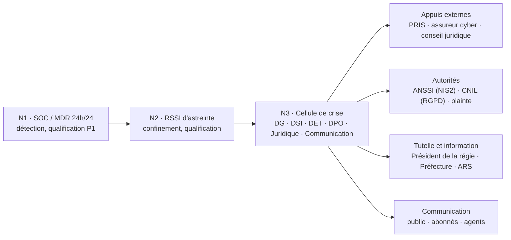

# Gestion de crise cyber et notifications réglementaires — HydroRégie

**Bloc 4 — Chronologie détection / qualification / escalade / remédiation, respect des délais de notification (alerte précoce 24 h, notification 72 h, rapport final 1 mois)**
**Destinataires :** Direction générale, DSI, RSSI, direction technique et exploitation, DPO, juridique
**Date de la note :** 7 octobre 2026 (scénario daté de mars 2028, voir section 1)
**Notifications rédigées associées :** voir section 8

---

## 1. Scénario de référence

Ce scénario sert de support à l'exercice de crise prévu par l'action A23 de la feuille de route (Bloc 2). Il met à l'épreuve l'architecture du Bloc 3.

| Élément | Hypothèse retenue |
|---|---|
| Date de l'incident | Vendredi 17 mars 2028, détection à 21 h 52, heure de Paris (heure d'hiver ; le passage à l'heure d'été a lieu le 26 mars) |
| État du programme de conformité | Vague 1 de segmentation déployée (usines A et B), SOC/MDR 24 h/24 en service, bastion de télémaintenance et MFA en place ; vague 2 (≈ 15 sites distants) encore en cours |
| Vecteur d'entrée | Compromission d'une session de maintenance de l'éditeur de l'ERP de facturation : l'attaquant épuise le technicien par des demandes MFA répétées jusqu'à ce que l'une soit validée |
| Déroulé de l'attaque | Mouvement latéral dans le SI de gestion, prise de contrôle de l'annuaire, exfiltration de la base des abonnés, puis chiffrement par un rançongiciel le vendredi soir |
| Effet sur le service d'eau | Aucun : production, distribution et qualité de l'eau non affectées |
| Effet sur le SI de gestion | Paralysé : messagerie, facturation, relation usagers, annuaire ; supervision de sécurité interne dégradée (la plateforme du prestataire MDR reste opérationnelle) |
| Données personnelles | Environ 190 000 abonnés concernés ; coordonnées, contrat, historique de consommation, et coordonnées bancaires (IBAN) pour environ 112 000 d'entre eux |
| Tentative vers l'OT | Échec : bloquée par la règle « aucun flux IT vers OT » et par le second facteur du bastion |
| Rançon | Demandée, non versée |

**Point de vigilance sur le droit applicable.** Le cas retient l'article 23 de la directive (24 h, 72 h, 1 mois) et l'ANSSI comme autorité nationale, conformément à l'énoncé. À la date de rédaction de cette note, les modalités françaises de dépôt (portail, formulaire) dépendent de la transposition et de ses textes d'application ; les notifications rédigées ici suivent le contenu prévu par la directive et devront être reportées dans le formulaire officiel le moment venu.

---

## 2. Délais applicables et règles de décompte

| Obligation | Autorité | Point de départ | Échéance | Contenu minimal |
|---|---|---|---|---|
| **NIS2 — alerte précoce** (art. 23 §4 a) | ANSSI (CSIRT national) | Prise de connaissance de l'incident important | 24 h | Acte malveillant suspecté ou non, impact transfrontalier possible ou non |
| **NIS2 — notification d'incident** (art. 23 §4 b) | ANSSI | Prise de connaissance de l'incident important | 72 h | Mise à jour de l'alerte, évaluation initiale (gravité, impact), indicateurs de compromission si disponibles |
| **NIS2 — rapport final** (art. 23 §4 d) | ANSSI | Dépôt de la notification des 72 h | 1 mois | Description détaillée, cause racine, mesures appliquées et en cours, impact transfrontalier |
| NIS2 — rapport d'étape (art. 23 §4 e) | ANSSI | Si l'incident est toujours en cours à l'échéance | Puis rapport final dans un mois après traitement | État d'avancement |
| NIS2 — information des destinataires de services (art. 23 §1 et §2) | Abonnés, usagers | Si l'incident est susceptible d'affecter la fourniture du service | Sans retard injustifié | Nature de l'incident, mesures à prendre |
| **RGPD — notification** (art. 33) | CNIL | Prise de connaissance de la violation | 72 h, si possible | Nature, catégories et nombre de personnes et de données, conséquences probables, mesures prises ; en plusieurs temps si nécessaire |
| **RGPD — information des personnes** (art. 34) | Personnes concernées | Risque élevé pour leurs droits et libertés | Dans les meilleurs délais | Nature de la violation, contact du DPO, conséquences, mesures |

**Quatre pièges de décompte, traités dans la chronologie :**

1. **Le décompte NIS2 commence à la prise de connaissance de l'incident important, pas à la première alerte technique.** Il faut donc une décision de qualification datée et tracée (événement E10).
2. **Le rapport final court un mois après le dépôt de la notification des 72 h**, pas un mois après l'incident. Le dépôt anticipé de la notification avance donc aussi l'échéance du rapport final.
3. **Les week-ends comptent.** Les échéances tombent samedi et lundi soir ; l'astreinte de direction et la rédaction hors des heures ouvrées sont prévues d'avance.
4. **NIS2 et RGPD sont deux régimes distincts**, avec des autorités, des points de départ et des contenus différents. La violation de données est constatée plus tard que l'incident (E23), ce qui décale l'échéance CNIL.

---

## 3. Grille de qualification

### 3.1 Incident important au sens de NIS2 (art. 23 §3)

Un incident est important s'il remplit au moins un des deux critères suivants.

| Critère | Application au scénario | Résultat |
|---|---|---|
| (a) Perturbation opérationnelle grave des services ou perte financière pour l'entité, réelle ou possible | SI de gestion paralysé plusieurs jours (facturation, relation usagers, messagerie), coûts de reprise significatifs | **Rempli** |
| (b) Dommages matériels ou immatériels considérables pour d'autres personnes | Données de ≈ 190 000 abonnés dont des coordonnées bancaires, avec menace de publication | **Rempli** |

**Conclusion : incident important, notification obligatoire.** Le défaut d'impact sur la production d'eau potable ne dispense pas de notifier : l'impact sur l'eau est un critère d'aggravation, pas une condition.

### 3.2 Niveaux de crise internes

| Niveau | Définition | Mobilisation | Notifications |
|---|---|---|---|
| N1 | Incident isolé, sans effet sur les services | SOC et RSSI | Aucune |
| N2 | Perturbation limitée du SI, sans donnée ni service critique touché | RSSI, DSI | Évaluer les critères NIS2 et RGPD |
| **N3** | **Atteinte majeure du SI de gestion, ou risque pour les données ou le service** | **Cellule de crise (DG, RSSI, DSI, DET, DPO, juridique, communication)** | **NIS2 et RGPD si critères remplis** |
| N4 | Service d'eau potable affecté ou risque sanitaire | Cellule de crise renforcée, préfecture, ARS, plan de continuité d'exploitation | NIS2, RGPD, information des autorités sanitaires |

Le scénario est classé **N3**. Le passage à N4 serait déclenché par toute anomalie sur les paramètres de qualité de l'eau, toute perte de contrôle de l'OT ou toute atteinte au SIS.

---

## 4. Organisation de crise

| Rôle | Fonction pendant la crise |
|---|---|
| Directeur général | Chef de cellule ; décisions de rupture (isolement, rançon) ; validation des notifications ; porte-parole |
| RSSI | Pilote technique ; qualification ; rédaction des notifications NIS2 ; point de contact avec l'ANSSI |
| DSI | Confinement et reconstruction du SI de gestion |
| DET | Garant de l'OT : intégrité, production, mode dégradé |
| DPO | Évaluation de la violation de données ; notification CNIL ; information des personnes |
| Juridique | Validation des textes, plainte, relations avec l'assureur et l'éditeur |
| Communication | Message public, abonnés, agents, médias ; une seule voix |
| Prestataire de réponse à incident (PRIS) | Investigation, endiguement, aide à la reconstruction |

**Règles de fonctionnement.** Une main courante horodatée et datée de chaque décision. Un canal de crise hors bande (outil de visioconférence et messagerie externes au SI, annuaire de crise imprimé) puisque la messagerie interne est indisponible. Aucun contact avec l'attaquant hors cadre fixé par la cellule. Aucune extinction des machines compromises avant prélèvement des preuves.

---

## 5. Chronologie de la crise

Les heures sont en heure de Paris. « Phase » indique le temps du cycle : **D** détection, **Q** qualification, **E** escalade, **R** remédiation, **N** notification.

### 5.1 Avant la détection (reconstitué après coup)

| Réf. | Date | Événement |
|---|---|---|
| E00a | Mar. 07/03, ≈ 17 h 50 | Un technicien de l'éditeur de l'ERP valide une demande MFA après 23 sollicitations. L'attaquant ouvre une session de maintenance via le portail d'accès distant et atteint le serveur applicatif de l'ERP (Z2) |
| E00b | 08/03 au 16/03 | Reconnaissance de l'annuaire, collecte d'identifiants (dont un compte de service de sauvegarde), obtention de droits d'administrateur de domaine IT. Aucune alerte : l'activité est portée par un compte d'éditeur autorisé |
| E00c | Nuits du 14 au 16/03 | Exfiltration d'environ 41 Go (base des abonnés) vers un stockage externe. Aucun seuil d'alerte sur les volumes sortants |

**Temps de présence de l'attaquant avant détection : 10 jours.** C'est l'écart le plus sérieux du scénario ; il est traité dans les actions correctives du rapport final.

### 5.2 Vendredi 17 mars

| Réf. | Heure | Phase | Événement ou décision | Responsable |
|---|---|---|---|---|
| E01 | 21 h 38 | – | Déploiement du rançongiciel depuis un contrôleur de domaine compromis | Attaquant |
| E02 | 21 h 52 | D | Alertes EDR : chiffrement massif et suppression de copies cachées sur les serveurs de fichiers et l'ERP, remontées à la plateforme MDR | SOC / MDR |
| E03 | 22 h 04 | D→Q | L'analyste qualifie P1 (rançongiciel actif) et déclenche l'astreinte | SOC / MDR |
| E04 | 22 h 07 | E | Appel du RSSI d'astreinte (prise en charge confirmée à 22 h 12). Ouverture de la main courante | RSSI |
| E05 | 22 h 25 | R | Décision d'isoler le SI de gestion : coupure du conduit IT/iDMZ au pare-feu FW2 et fermeture du portail d'accès distant. Exécutée à 22 h 28 | RSSI, DSI d'astreinte |
| E06 | 22 h 31 | D | FW2 bloque 14 tentatives de connexion d'un serveur IT vers le bastion (règle « aucun flux IT vers OT »), journalisées et remontées au SOC | SOC / MDR |
| E07 | 22 h 40 | R | Coupure de l'accès Internet sortant du SI de gestion au NGFW (arrêt de l'exfiltration et du pilotage à distance). Révocation du compte de l'éditeur et des comptes à privilèges suspects | RSSI, DSI |
| E08 | 22 h 47 | D | Six tentatives d'authentification sur le bastion avec des identifiants issus de l'IT : échec au second facteur et à l'annuaire OT (aucune approbation entre les deux annuaires). Compte verrouillé, alerte au SOC. **La tentative de pivot vers l'OT échoue** | SOC / MDR |
| E09 | 23 h 00 | E | Le RSSI informe le DG d'astreinte. Appel du DSI, du DET et du DPO | RSSI |
| **E10** | **23 h 10** | **Q** | **Qualification en « incident important » (NIS2) et niveau de crise N3. Heure de prise de connaissance retenue : 23 h 10. Les compteurs sont lancés : alerte précoce avant le samedi 18/03 à 23 h 10, notification avant le lundi 20/03 à 23 h 10** | **DG, RSSI** |
| E11 | 23 h 20 | Q | Le DET d'astreinte vérifie l'OT : valeurs de process nominales, aucune modification de consigne, sauvegardes de configuration (A07) intactes. Décision : production maintenue en autonomie locale, conduit IT/OT laissé coupé | DET |
| E12 | 23 h 30 | E | Première réunion de la cellule de crise sur le canal hors bande. Attribution des rôles, ouverture du registre des décisions. Consignes : aucun contact avec l'attaquant, aucun paiement avant décision de la cellule | DG |
| E13 | 23 h 50 | R | Préservation des preuves : machines isolées du réseau mais laissées allumées, copies des machines virtuelles, export des journaux NGFW, EDR et MDR | RSSI, DSI |

### 5.3 Samedi 18 mars

| Réf. | Heure | Phase | Événement ou décision | Responsable |
|---|---|---|---|---|
| E14 | 00 h 40 | E | Activation du prestataire de réponse à incident (contrat-cadre), à pied d'œuvre à distance dès 02 h 00 | RSSI |
| E15 | 02 h 00 | Q | Premier périmètre : 94 serveurs sur 156 et 212 postes sur 240 touchés ou injoignables. Sauvegardes immuables intactes, mais leur antériorité par rapport à la compromission initiale reste à établir | PRIS, DSI |
| E16 | 07 h 30 | E | Le DG informe le président de la régie (tutelle) | DG |
| E17 | 09 h 00 | E | Réunion de cellule N3 : point de situation, porte-parole désigné, plan de communication | DG |
| E18 | 09 h 15 | E | Déclaration à l'assureur cyber (garanties et assistance) | Juridique |
| E19 | 09 h 30 | E | Information à titre de précaution de la permanence de la préfecture et de l'ARS : production et qualité de l'eau non affectées, contrôle sanitaire maintenu | DG |
| E20 | 10 h 00 | N | Rédaction de l'alerte précoce, validation par le DG à 11 h 45 | RSSI, Juridique |
| **E21** | **12 h 20** | **N** | **Dépôt de l'alerte précoce NIS2** (pièce 1). Marge de 10 h 50 sur l'échéance | **RSSI** |
| E22 | 14 h 10 | R | Contrôle des ≈ 15 sites distants, dont la segmentation (vague 2) n'est pas terminée : aucun indice de compromission, accès WAN depuis l'IT coupés, mots de passe de télémaintenance changés | DET |
| **E23** | **16 h 40** | **Q** | **Qualification RGPD : l'analyse des journaux confirme 41 Go sortis vers un hébergeur externe et la présence d'une extraction de la base des abonnés. Violation de confidentialité certaine. Heure de prise de connaissance RGPD : 16 h 40 ; échéance CNIL : mardi 21/03 à 16 h 40** | **DPO** |
| E24 | 18 h 00 | N | Communiqué public (site hébergé hors SI, réseaux sociaux, radio locale) : incident informatique, eau potable et qualité non affectées, services clients dégradés, numéro d'appel externalisé | Communication |
| E25 | 20 h 00 | E | Décision de **ne pas payer la rançon** (DG, avec l'avis du prestataire, de l'assureur et du juridique, conformément à la doctrine des autorités) | DG |

### 5.4 Dimanche 19 et lundi 20 mars

| Réf. | Date et heure | Phase | Événement ou décision | Responsable |
|---|---|---|---|---|
| E26 | Dim. 19/03, 10 h 00 | R | Point de situation N3. Mise en place d'un environnement de reconstruction propre. Ordre de restauration : annuaire, messagerie, ERP et CRM, postes | DSI, PRIS |
| E27 | Dim. 19/03, 11 h 00 | N | Rédaction de la notification des 72 h, validation du DG à 15 h 15 | RSSI |
| **E28** | **Dim. 19/03, 16 h 00** | **N** | **Dépôt de la notification d'incident NIS2** (pièce 2). Marge de 31 h 10. **Le délai du rapport final court : échéance mercredi 19/04/2028 à 16 h 00** | **RSSI** |
| E29 | Lun. 20/03, 08 h 30 | R | Début de la reconstruction de l'annuaire à partir de sauvegardes antérieures à la compromission (≤ 06/03), réinitialisation de tous les secrets | DSI, PRIS |
| **E30** | **Lun. 20/03, 10 h 30** | **N** | **Dépôt de la notification initiale à la CNIL** (pièce 4). Marge de 30 h 10. Mise à jour du registre des violations | **DPO** |
| E31 | Lun. 20/03, 11 h 00 | N | Dépôt de plainte auprès des services d'enquête spécialisés (note de rançon, journaux) | Juridique |

### 5.5 Du mardi 21 au vendredi 24 mars

| Réf. | Date et heure | Phase | Événement ou décision | Responsable |
|---|---|---|---|---|
| E32 | Mar. 21/03, 09 h 00 | D | Publication d'un échantillon de la base sur un site de fuite, avec menace de diffusion complète : **aggravation** (données diffusées) | PRIS |
| E33 | Mar. 21/03, 11 h 30 | E | La cellule prend acte de l'aggravation. Demande de retrait à l'hébergeur par le prestataire, veille du site de fuite, préparation du complément CNIL | DG, DPO |
| E34 | Mar. 21/03, 18 h 00 | R | Annuaire et messagerie rétablis dans l'environnement propre ; reconnexion progressive des postes réinstallés | DSI |
| E35 | Mer. 22/03, 10 h 00 | N | Complément de notification CNIL : publication d'un échantillon, nombre confirmé de personnes (≈ 190 000, dont ≈ 112 000 avec IBAN) | DPO |
| E36 | Mer. 22/03, 14 h 00 | E | Décision d'informer chaque personne concernée (risque élevé : identité et coordonnées bancaires) | DG, DPO |
| E37 | Jeu. 23/03, 09 h 00 | N | Information des personnes : courriels (≈ 171 000 adresses) via une plateforme d'envoi externe, courriers postaux pour les autres, FAQ publique, conseils (hameçonnage, surveillance des prélèvements, opposition) | DPO, Communication |
| E38 | Ven. 24/03, 17 h 00 | R | ERP de facturation rétabli (J+7), centre d'appel opérationnel ; rattrapage de la facturation planifié | DSI |

### 5.6 Suites

| Réf. | Date | Phase | Événement ou décision | Responsable |
|---|---|---|---|---|
| E39 | Ven. 07/04/2028 | R | Fin de la crise : retour au niveau N1 après vérification de l'absence de persistance de l'attaquant | RSSI, PRIS |
| E40 | Mer. 12/04/2028 | – | Retour d'expérience à chaud, avec le prestataire | RSSI |
| **E41** | **Mar. 18/04/2028, 11 h 00** | **N** | **Dépôt du rapport final NIS2** (pièce 3). Le lundi 17/04 est férié (lundi de Pâques) ; dépôt anticipé d'un jour ouvré. Marge de 29 h | **RSSI** |
| E42 | Mai 2028 | – | Retour d'expérience approfondi, plan d'actions correctives intégré au pilotage cyber, revue de direction | DG, RSSI |

---

## 6. Compteur des délais

| Notification | Point de départ | Échéance | Dépôt | Marge |
|---|---|---|---|---|
| NIS2 — alerte précoce (24 h) | Ven. 17/03, 23 h 10 | Sam. 18/03, 23 h 10 | Sam. 18/03, 12 h 20 | 10 h 50 |
| NIS2 — notification (72 h) | Ven. 17/03, 23 h 10 | Lun. 20/03, 23 h 10 | Dim. 19/03, 16 h 00 | 31 h 10 |
| NIS2 — rapport final (1 mois) | Dim. 19/03, 16 h 00 | Mer. 19/04, 16 h 00 | Mar. 18/04, 11 h 00 | 29 h |
| RGPD — CNIL (72 h) | Sam. 18/03, 16 h 40 | Mar. 21/03, 16 h 40 | Lun. 20/03, 10 h 30 | 30 h 10 |
| RGPD — information des personnes | Mer. 22/03 (décision) | Dans les meilleurs délais | Jeu. 23/03, 09 h 00 | – |

---

## 7. Arbitrages et limites

| Arbitrage | Choix retenu | Contrepartie assumée |
|---|---|---|
| Isoler vite ou comprendre d'abord | Isolement immédiat du SI de gestion (E05, E07) | Perte de la possibilité d'observer l'attaquant en action ; préservation des preuves compensée par la conservation des machines allumées et isolées |
| Notifier tôt ou notifier complet | Alerte précoce à moins de 14 h de la qualification, avec les seules informations établies | Contenu volontairement incomplet ; la directive prévoit des mises à jour successives |
| Payer ou non la rançon | Refus | Risque de publication des données (survenu en E32) ; la restauration repose sur les sauvegardes |
| Informer les personnes tout de suite ou après analyse | Information le 23/03, après confirmation du périmètre et de l'aggravation | Quatre jours sans information individuelle ; compensés par le communiqué public du 18/03 |
| Restaurer vite ou restaurer propre | Reconstruction dans un environnement propre, à partir de sauvegardes antérieures à la compromission | Sept jours pour la facturation, contre un retour plus rapide mais risqué à partir de sauvegardes douteuses |

**Limites du scénario :**
- **Le délai de détection est mauvais** (10 jours). Un SOC en service n'a pas détecté un compte d'éditeur détourné ni 41 Go de sorties. Ce n'est pas un détail : c'est le principal enseignement.
- **La vague 2 n'était pas terminée**, ce qui oblige à vérifier les sites distants à la main (E22). Un incident plus tardif aurait trouvé ces sites mieux protégés ; un incident plus précoce, moins.
- **L'architecture du Bloc 3 a fonctionné sur le point précis où elle était conçue pour fonctionner** (aucun flux IT vers OT, second facteur et annuaire distincts au bastion, autonomie des sites), mais pas sur l'IT elle-même, restée à plat.

---

## 8. Livrables associés

| Pièce | Fichier | Échéance respectée |
|---|---|---|
| 1. Alerte précoce NIS2 (24 h) | [Notification_1_Alerte_Precoce_24h.md](Notification_1_Alerte_Precoce_24h.md) | Sam. 18/03, 12 h 20 |
| 2. Notification d'incident NIS2 (72 h) | [Notification_2_Notification_72h.md](Notification_2_Notification_72h.md) | Dim. 19/03, 16 h 00 |
| 3. Rapport final NIS2 (1 mois) | [Notification_3_Rapport_Final_1_mois.md](Notification_3_Rapport_Final_1_mois.md) | Mar. 18/04, 11 h 00 |
| 4. Notification CNIL (RGPD) et information des abonnés | [Notification_4_CNIL_Violation_Donnees.md](Notification_4_CNIL_Violation_Donnees.md) | Lun. 20/03, 10 h 30 |

Cette chronologie s'appuie sur les actions du Bloc 2 (A04 procédure de notification, A07 sauvegardes, A11 et A15 SOC/MDR, A20 gestion des accès à privilèges, A23 exercice de crise) et sur les frontières du Bloc 3.
