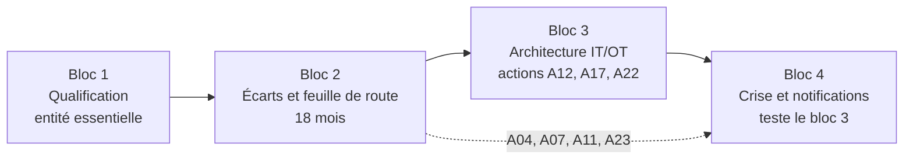

# Mise en conformité NIS2 — cas HydroRégie

Cas pratique de 2 jours, La Plateforme_ Marseille — auteur : Samet ARI.
Il prolonge le projet RGPD conduit précédemment (X-corp).

**Mission.** Une équipe projet est mandatée par HydroRégie, régie des eaux (450 000 habitants) qualifiée entité essentielle, pour conduire sa mise en conformité à la directive (UE) 2022/2555 (NIS2) : qualification, analyse d'écart, architecture IT/OT et gestion de crise.

---

## Livrables par bloc

| Bloc | Livrable demandé | Fichier | En une phrase |
|---|---|---|---|
| 1 | Note de qualification réglementaire | [01-qualification/Note_Qualification_NIS2_HydroRegie.md](01-qualification/Note_Qualification_NIS2_HydroRegie.md) | Entité essentielle : secteur eau potable (annexe I) et critère de taille, avec une seconde voie indépendante de la taille |
| 2 | Analyse d'écart et feuille de route | [02-analyse-ecart/Analyse_Ecart_Feuille_de_Route_NIS2_HydroRegie.md](02-analyse-ecart/Analyse_Ecart_Feuille_de_Route_NIS2_HydroRegie.md) | Maturité 1,7/3 sur l'article 21 ; programme de 18 mois, 25 actions datées et responsabilisées, environ 3,75 M€ |
| 3 | Schéma d'architecture argumenté | [03-architecture-it-ot/Architecture_Reseau_Segmentee_IT_OT_HydroRegie.md](03-architecture-it-ot/Architecture_Reseau_Segmentee_IT_OT_HydroRegie.md) | Zones et conduits IEC 62443, DMZ industrielle, bastion, flux autorisés ; schéma en [SVG](03-architecture-it-ot/Schema_Architecture_IT_OT_HydroRegie.svg) et [PNG](03-architecture-it-ot/Schema_Architecture_IT_OT_HydroRegie.png) |
| 4 | Chronologie de crise et notifications rédigées | [04-gestion-de-crise/Chronologie_Gestion_de_Crise_HydroRegie.md](04-gestion-de-crise/Chronologie_Gestion_de_Crise_HydroRegie.md) | Rançongiciel via un compte fournisseur, 45 événements datés, quatre notifications |

Notifications du bloc 4 :
[1. alerte précoce 24 h](04-gestion-de-crise/Notification_1_Alerte_Precoce_24h.md) ·
[2. notification 72 h](04-gestion-de-crise/Notification_2_Notification_72h.md) ·
[3. rapport final 1 mois](04-gestion-de-crise/Notification_3_Rapport_Final_1_mois.md) ·
[4. CNIL (RGPD) et information des abonnés](04-gestion-de-crise/Notification_4_CNIL_Violation_Donnees.md)

---

## Fil conducteur

Les quatre blocs forment une chaîne : le statut du bloc 1 fixe le niveau d'exigence ; le bloc 2 en déduit un programme dont la segmentation (actions A12, A17, A22) est détaillée au bloc 3 ; le bloc 4 met cette architecture à l'épreuve dans un scénario d'attaque.



---

## HydroRégie en bref (entité fictive)

| Élément | Valeur retenue |
|---|---|
| Statut juridique | Régie directe (établissement public) |
| Effectif et budget | ≈ 200 agents ; ≈ 75 M€ de chiffre d'affaires ou de budget annuel |
| Sites | 1 siège, 2 usines de production et de traitement, ≈ 15 réservoirs et stations |
| Maturité cyber de départ | Moyenne : PSSI à jour, RSSI à temps plein dont le périmètre ne couvre pas l'OT, OT mixte avec inventaire incomplet |
| Programme | 18 mois, du 1er novembre 2026 au 30 avril 2028 |
| Pare-feux | Fonctions décrites, marque laissée au marché public |

---

## Hypothèses et limites

- **Tout est fictif** : entité, chiffres, budget, noms de domaine, adresses IP, numéros de téléphone et références d'enregistrement. Les indicateurs de compromission utilisent des plages réservées à la documentation.
- **Droit applicable.** Les notifications suivent l'article 23 de la directive (24 h, 72 h, un mois). Les modalités françaises de dépôt dépendent de la transposition et de ses textes d'application, qui n'étaient pas finalisés lors de la rédaction ; le formulaire officiel prévaudra.
- **Niveaux de sécurité cibles (SL-T)** : propositions de travail, à valider par l'analyse de risques (action A09).
- **Maturité par domaine, montants, délais** : ordres de grandeur du cas, pas des chiffrages.
- **Limite assumée du scénario de crise** : l'attaquant reste dix jours sans être détecté. L'architecture du bloc 3 protège l'OT, mais pas l'IT, restée « à plat » ; c'est l'enseignement principal du rapport final.

---

## Références

- [Directive (UE) 2022/2555 (NIS2), texte officiel](https://eur-lex.europa.eu/eli/dir/2022/2555/oj)
- [Directive NIS 2 — ANSSI (MesServicesCyber)](https://messervices.cyber.gouv.fr/nis2)
- [MonEspaceNIS2 — ANSSI](https://monespacenis2.cyber.gouv.fr/directive/)
- [CNIL — notifier une violation de données personnelles](https://cnil.fr/fr/services-en-ligne/notifier-une-violation-de-donnees-personnelles)

---

## Arborescence

```
NIS2/
├── README.md
├── 01-qualification/
│   └── Note_Qualification_NIS2_HydroRegie.md
├── 02-analyse-ecart/
│   └── Analyse_Ecart_Feuille_de_Route_NIS2_HydroRegie.md
├── 03-architecture-it-ot/
│   ├── Architecture_Reseau_Segmentee_IT_OT_HydroRegie.md
│   ├── Schema_Architecture_IT_OT_HydroRegie.svg
│   └── Schema_Architecture_IT_OT_HydroRegie.png
└── 04-gestion-de-crise/
    ├── Chronologie_Gestion_de_Crise_HydroRegie.md
    ├── Notification_1_Alerte_Precoce_24h.md
    ├── Notification_2_Notification_72h.md
    ├── Notification_3_Rapport_Final_1_mois.md
    └── Notification_4_CNIL_Violation_Donnees.md
```
